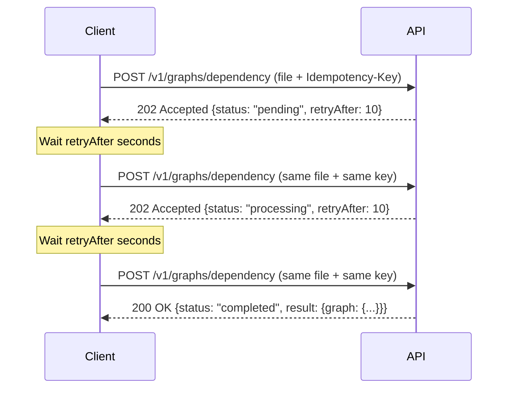

All graph generation endpoints are **asynchronous**. When you submit a request, the API creates a background job and returns immediately with a job status. You then poll for results by re-submitting the same request with the same `Idempotency-Key`.

## How It Works



## Job Statuses

| Status | HTTP Code | Description |
|--------|-----------|-------------|
| `pending` | 202 | Job is queued, waiting to be processed |
| `processing` | 202 | Job is actively being analyzed |
| `completed` | 200 | Job finished successfully, `result` field contains the graph |
| `failed` | 200 | Job encountered an error, `error` field contains the message |

## Response Envelope

All graph endpoints return a consistent envelope:

```json
{
  "status": "pending | processing | completed | failed",
  "jobId": "unique-job-identifier",
  "retryAfter": 5,
  "result": { ... },
  "error": "error message if failed"
}
```

- **`status`** - Current job state
- **`jobId`** - Unique identifier for the job
- **`retryAfter`** - Recommended seconds to wait before the next poll (only present for pending/processing)
- **`result`** - The graph data (only present when completed)
- **`error`** - Error description (only present when failed)

## Polling with cURL

Store the `Idempotency-Key` in a variable and re-use it for polling:

```bash
IDEMPOTENCY_KEY=$(uuidgen)

# Submit the job
curl --request POST \
  --url https://api.supermodeltools.com/v1/graphs/dependency \
  --header "Idempotency-Key: $IDEMPOTENCY_KEY" \
  --header 'X-Api-Key: <your-api-key>' \
  --header 'Content-Type: multipart/form-data' \
  --form file='@repo.zip'

# Poll until completed (re-submit the same request)
curl --request POST \
  --url https://api.supermodeltools.com/v1/graphs/dependency \
  --header "Idempotency-Key: $IDEMPOTENCY_KEY" \
  --header 'X-Api-Key: <your-api-key>' \
  --header 'Content-Type: multipart/form-data' \
  --form file='@repo.zip'
```

<Tip>
  The server uses the `Idempotency-Key` to identify your existing job. Re-submitting the file does not create a duplicate job.
</Tip>

## Using the SDK

The `@supermodeltools/sdk` package handles polling automatically. Install it with:

```bash
npm install @supermodeltools/sdk
```

### Basic Usage

```typescript
import { Configuration, DefaultApi, SupermodelClient } from '@supermodeltools/sdk';
import * as fs from 'fs';

const config = new Configuration({
  basePath: 'https://api.supermodeltools.com',
  apiKey: 'smsk_live_...',
});

const api = new DefaultApi(config);
const client = new SupermodelClient(api);

// Read your zip file
const zipBuffer = fs.readFileSync('repo.zip');
const file = new Blob([zipBuffer], { type: 'application/zip' });

// This handles polling internally and returns the completed result
const result = await client.generateDependencyGraph(file);
console.log(result.graph.nodes);
```

### Configuring Polling Behavior

```typescript
const controller = new AbortController();

const client = new SupermodelClient(api, {
  timeoutMs: 600000,             // Max wait time: 10 minutes (default: 5 minutes)
  defaultRetryIntervalMs: 3000,  // Poll interval if server doesn't specify (default: 5s)
  maxPollingAttempts: 120,       // Max number of polls (default: 60)
  onPollingProgress: (progress) => {
    console.log(`Attempt ${progress.attempt}/${progress.maxAttempts} - ${progress.status}`);
  },
  signal: controller.signal,     // AbortSignal for cancellation
});

// To cancel polling at any point:
// controller.abort();
```

### Available Methods

| Method | Endpoint |
|--------|----------|
| `client.generateDependencyGraph(file)` | `/v1/graphs/dependency` |
| `client.generateCallGraph(file)` | `/v1/graphs/call` |
| `client.generateDomainGraph(file)` | `/v1/graphs/domain` |
| `client.generateParseGraph(file)` | `/v1/graphs/parse` |
| `client.generateSupermodelGraph(file)` | `/v1/graphs/supermodel` |

## Error Handling

If a job fails, the response will have `status: "failed"` with an `error` message:

```json
{
  "status": "failed",
  "jobId": "550e8400-e29b-41d4-a716-446655440000",
  "error": "Nested archives are not supported"
}
```

Common failure reasons:

| Error | Resolution |
|-------|------------|
| Nested archives | Exclude `.zip`/`.tar` files from your archive using `.gitattributes` with `export-ignore` |
| File exceeds size limits | Exclude large binary files from the archive |
| Blob expired | Job waited too long in the queue; retry with a new idempotency key |

<Warning>
  Jobs have a limited processing window. If a job stays in `pending` status too long, the uploaded file may expire and the job will be marked as `failed`.
</Warning>

## Idempotency Key Behavior

The `Idempotency-Key` scopes a job to your API key. Key behaviors:

- **Same key, same user**: Returns the existing job (no duplicate processing)
- **Same key, different user**: Creates independent jobs (no conflict)
- **New key, same file**: Creates a new job (useful for re-analysis after code changes)

<Info>
  Completed jobs are retained for 24 hours. After that, submitting the same idempotency key will create a new job.
</Info>
